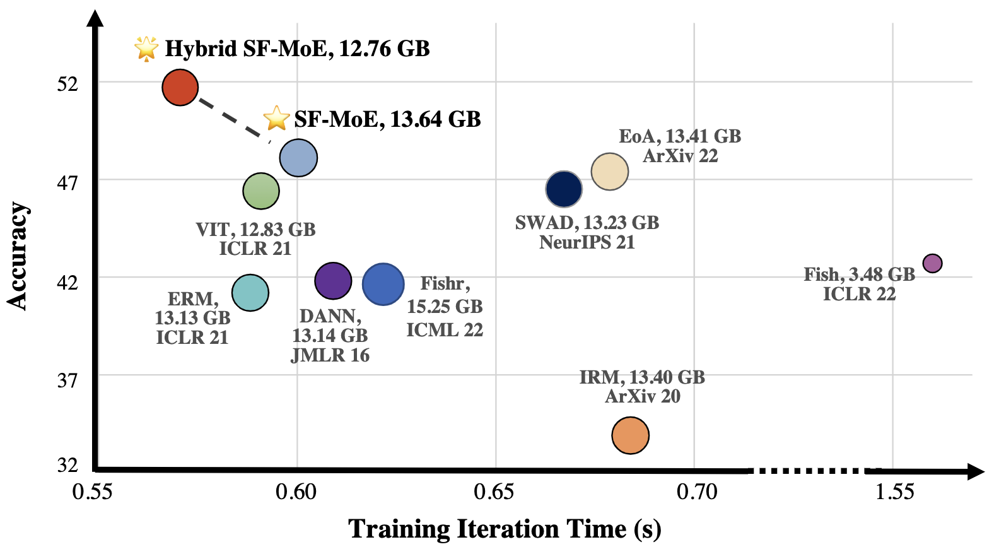
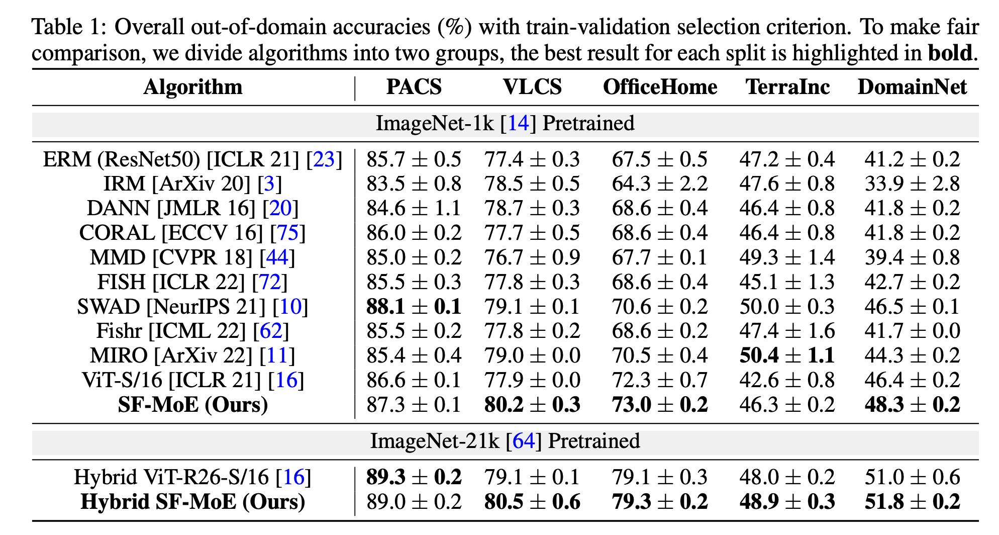
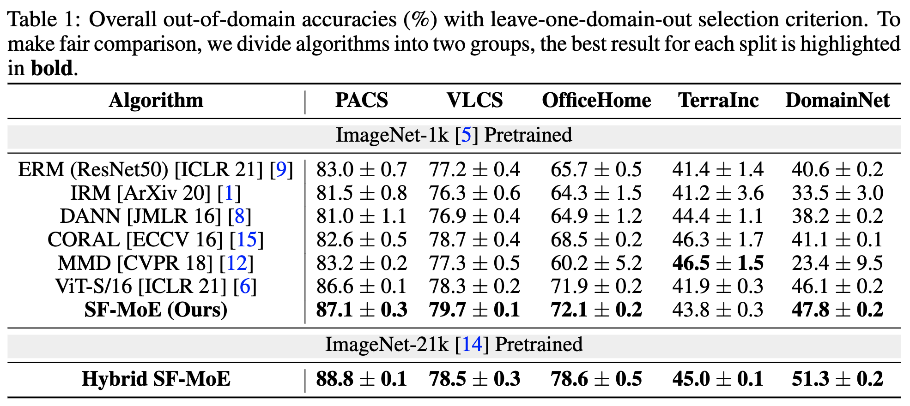
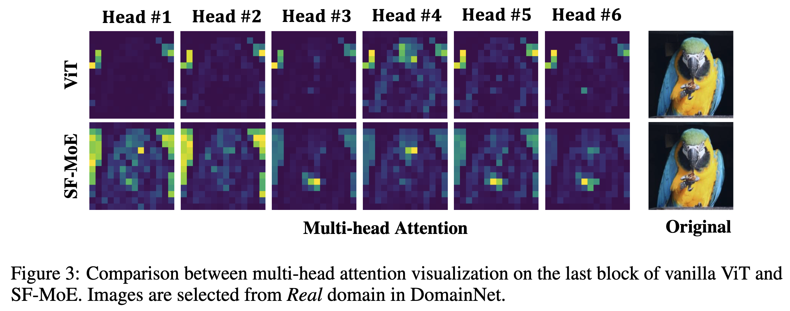

# Welcome to Sparse Fusion Mixture-of-Experts for Domain Generalization
[](https://paperswithcode.com/sota/domain-generalization-on-domainnet?p=sparse-fusion-mixture-of-experts-are-domain)

In this work, we reveal the mixture-of-experts (MoE) model's generalizability on DG by leveraging  to distributively handle multiple aspects of the predictive features across domains.

To this end, we propose [**Sparse Fusion Mixture-of-Experts (SF-MoE)**](https://arxiv.org/abs/2206.04046), which incorporates sparsity and fusion mechanisms into the MoE framework to keep the model both sparse and predictive.

### Performance Comparison

$x$-axis is the training iteration time per mini-batch with 160 images (lower is better). 

$y$-axis is the overall accuracy on DomainNet with training-validation model selection criterion (higher is better). 

The **bubble size** and the text floating around demonstrate the run-time memory cost during training (smaller is better)
<p align="center">
    
</p>

### Diagram of SF-MoE
<p align="center">
    
</p>

## Preparation

### Dependencies

```sh
pip install -r requirements.txt
```

### Datasets

```sh
python3 -m domainbed.scripts.download \
       --data_dir=./domainbed/data
```

### Environments

Environment details used in paper for the main experiments on Nvidia V100 GPU.

```shell
Environment:
	Python: 3.9.7
	PyTorch: 1.8.1
	Torchvision: 0.9.1
	CUDA: 10.1
	CUDNN: 7603
	NumPy: 1.21.4
	PIL: 9.0.1
```

## Start Training

Train a model:

```sh
python3 -m domainbed.scripts.train\
       --data_dir=./domainbed/data/OfficeHome/\
       --algorithm SFMOE\
       --dataset OfficeHome\
       --test_env 2
```

To visualize attention heads output
```shell
python exps/vis_attention.py
```

In `vis_attention.py`, load model with trained `pth` file and defined architecture, e.g.,

```python
model_path = '{project_path}/sweep/output/{exp_name}/d2c8a444c1472737722e9354afe0f994/model.pkl'
model = vision_transformer.deit_small_patch16_224(pretrained=True, num_classes=0, moe_interval=24, num_experts=4, Hierachical=False).cuda()
state_dict = torch.load(model_path)['model_dict']
only_weights = OrderedDict()
for item in state_dict.keys():
    if 'head' not in item:
        only_weights[item.replace('model.', '')] = state_dict[item]
```

Our Hyper-parameters for each dataset:


|               | PACS | VLCS | OfficeHome | TerraIncognita | DomainNet |
|---------------| ------ | ------ | ------------ | ---------------- | ----------- |
| Learning rate | 3e-5 | 1e-5 | 3e-5       | 3e-5           | 3e-5      |
| Dropout       | 0.0  | 0.5  | 0.1        | 0.0            | 0.1       |
| Weight decay  | 0.0  | 1e-6 | 1e-6       | 1e-4           | 0.0       |

## Experimental Results

### Available model selection criteria

[Model selection criteria](domainbed/model_selection.py) differ in what data is used to choose the best hyper-parameters for a given model:

* `IIDAccuracySelectionMethod`: A random subset from the data of the training domains.
* `LeaveOneOutSelectionMethod`: A random subset from the data of a held-out (not training, not testing) domain.

### Train-val selection strategy
<p align="center">
    
</p>

### Leave-one-domain-out selection strategy
<p align="center">
    
</p>

### Multi-heads Attention Visualization
<p align="center">
    
</p>

### Model Zoo & Records
We share the SF-MoE trained models and records on DomainNet via the following [directory](https://entuedu-my.sharepoint.com/:f:/g/personal/libo0013_e_ntu_edu_sg/ElEEAWuckgZKlDsK6inCa0UBs-KJcCG49ef30wmFmmW1og?e=2Gl0w0). The records follow the [DomainBed](https://github.com/facebookresearch/DomainBed) format.

## License

This source code is released under the MIT license, included [here](LICENSE).

## Acknowledgement
This repo's kernel module is built on [lucidrains/mixture_of_experts](https://github.com/lucidrains/mixture-of-experts)